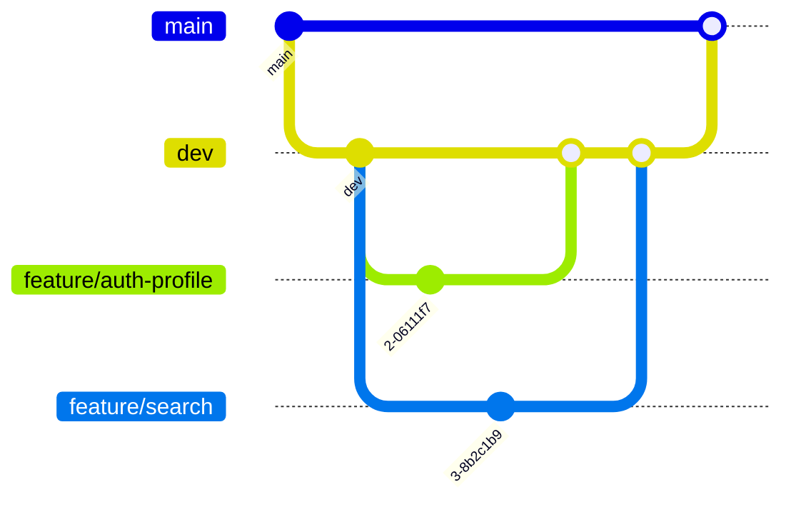

# Evently
## *Where every event finds its crowd.*

Evently is a modern, full-stack event management application with robust authentication, user profiles, and seamless feature-driven development workflow. This project follows best practices in Git and GitHub branching, making it easy to collaborate, track features, and maintain code quality.

---

## 🚀 Features

### ✨ Authentication
- **JWT-based Auth:** Secure login and registration.
- **Protected Routes:** Only authenticated users can access certain pages.
- **Password Encryption:** User passwords are safely hashed and stored.

### 🧑‍💻 User Profile
- **Profile Page:** Beautifully designed personal dashboard.
- **Avatar Upload:** Upload and preview your profile picture with drag-and-drop or click-to-upload.
- **Interests:** Add, edit, and display your personal interests as stylish badges.
- **Edit Mode:** Smooth transitions between view and edit states.
- **Logout:** Secure one-click logout.

### 🏗️ Branching & Workflow
- **Main Branch:** Stable, production-ready code.
- **Dev Branch:** Integration branch for feature testing and QA.
- **Feature Branches:** Short-lived branches for each feature (`feature/your-feature-name`), merged into `dev` upon completion.
- **Pull Requests:** All new features and fixes are reviewed via PRs before merging.

### 🎨 UI/UX
- **Tailwind CSS:** Responsive, modern, and accessible design.
- **Gradient Banners:** Eye-catching profile headers.
- **Animated Elements:** Interactive buttons, smooth hover effects, and animated icons.

### 🛠️ Tech Stack
- **Frontend:** React, TypeScript, Tailwind CSS
- **Backend:** Node.js, Express, MongoDB
- **Authentication:** JWT
- **File Uploads:** Multer (for avatar/profile pictures)

---

## 🌳 Branching Model



- Create feature branches from `dev`.
- Open PRs to merge features into `dev`.
- After testing, merge `dev` into `main` for release.

---

## 🚦 Getting Started

### 1. **Clone the repository**
```bash
git clone https://github.com/your-username/evently.git
cd evently
```

### 2. **Install dependencies**
```bash
# For both frontend and backend
npm install
```

### 3. **Run locally**
```bash
# Backend
cd backend
npm run dev

# Frontend (in another terminal)
cd frontend
npm start
```

### 4. **Start developing**
- Create a branch: `git checkout -b feature/your-feature-name dev`
- Push and open a pull request to `dev` when ready.

---

## 📁 Project Structure

```
evently/
├── backend/
│   ├── controllers/
│   ├── models/
│   ├── routes/
│   └── ...
├── frontend/
│   ├── src/
│   │   ├── components/
│   │   ├── pages/
│   │   ├── services/
│   │   └── ...
│   └── ...
└── README.md
```

---

## 📝 Contributing

We welcome contributions!  
1. Fork the repo  
2. Create your feature branch from `dev`  
3. Commit your changes  
4. Push to your fork  
5. Open a Pull Request to the `dev` branch

---

## 🦸‍♂️ Authors

- [Sanidhya Singh](https://github.com/ssanidhya0407)
- [Kakarlapudi Meghana](https://github.com/Meghana1708)

---
---

## 💡 License

This project is licensed under the MIT License.

---

## ⭐️ Show your support

Give us a star ⭐️ if you like the project!
